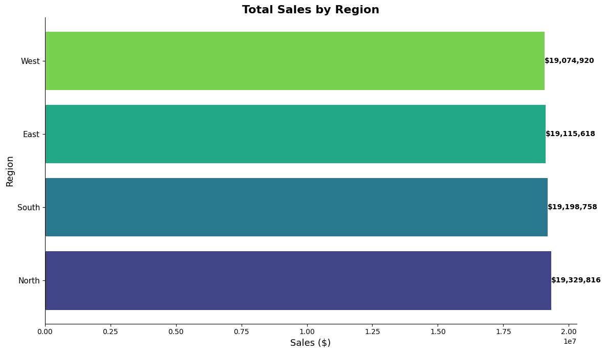

# 🛒 Retail Sales Region Analysis

## 📍 Problem Statement
A retail company suspected revenue leakage and inconsistent reporting across different U.S. regions. My role was to audit and analyze their transactional sales data (70,000+ rows) and deliver insights that could inform strategic decisions.

## 🔧 What I Did
- Cleaned messy sales data with missing values and inconsistent formatting
- Standardized region names and parsed date values
- Engineered business-relevant features like `total_sales` and `high_value_order`
- Conducted exploratory data analysis (EDA) using pandas, matplotlib, and seaborn
- Built a summary table for regional performance
- Visualized total sales by region and identified the North as the top-performing area

## 🧪 Key Insights
- North generated the highest total revenue and had the highest percentage of high-value orders (> $1,000)
- This may reflect stronger marketing, regional demand, or effective local strategies
- Recommended deeper analysis into seasonal and product-level trends in North region

## 📊 Tools & Libraries
- Python (pandas, NumPy, matplotlib, seaborn)
- Jupyter (VS Code extension)
- Git & GitHub for version control

## 📁 Files
- `retail_sales_dataset.csv` – Original dataset
- `retail_sales_cleaned.ipynb` – Full cleaning, EDA, and feature engineering
- `README.md` – This file

### 🖼 Sample Output
